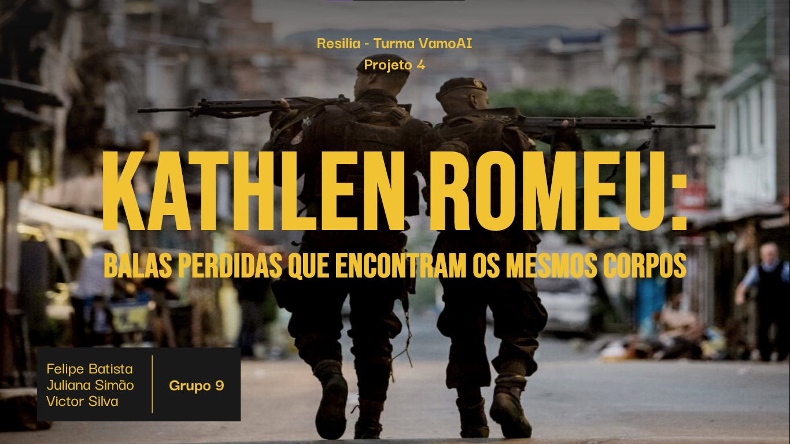
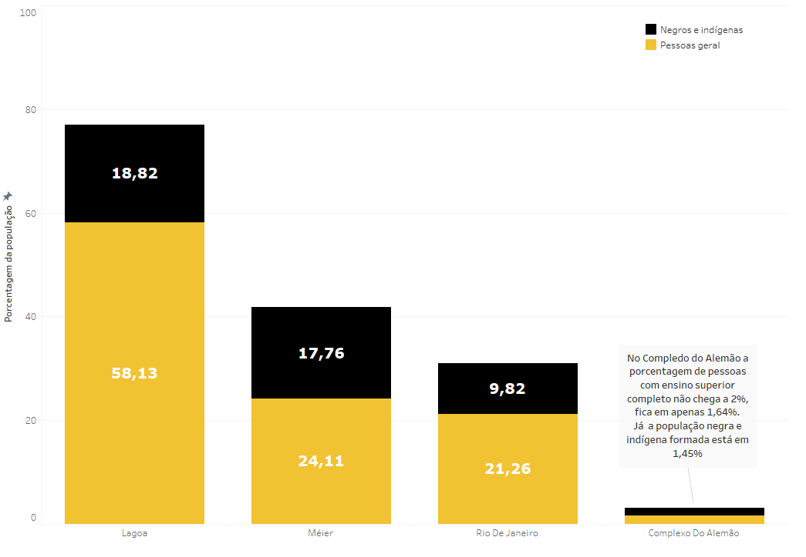
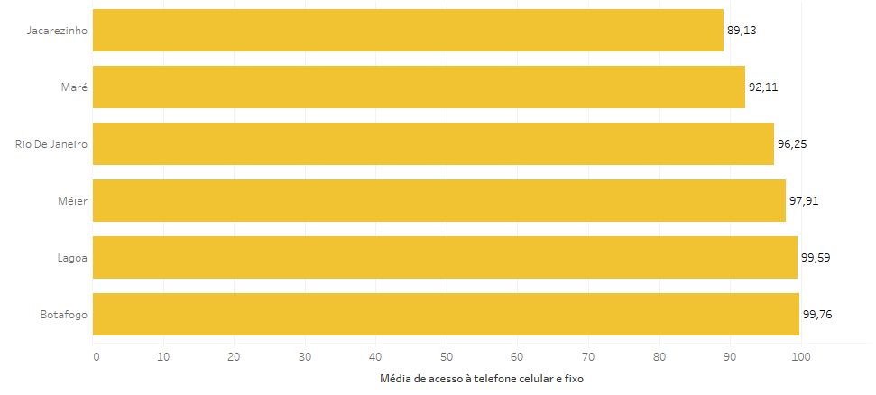

# Projeto 4 - Turma VamoAI

# O projeto

A turma VamoAI é uma parceria do [Ifood](https://institucional.ifood.com.br/) com a instituição de ensino [Resilia Educação](https://www.resilia.work/sobre) para a formação de novos analistas de dados.

A cada módulo produzimos um novo projeto, em grupos, para finalizarmos mais uma etapa de nossa jornada. Neste módulo 4 fizemos uma análise exploratória, uma visualização e um storietelling com base nos dados do [IPS Rio de janeiro](http://ipsrio.com.br/#aspects%5B%5D=1&aspects%5B%5D=19&aspects%5B%5D=35&aspects%5B%5D=2&map-type=performance&active-cat=1&page=1&tab=map).

Para contarmos a história, baseada nos dados, escolhemos a trajetória de [Kathlen de Oliveira Romeu](https://g1.globo.com/rj/rio-de-janeiro/noticia/2021/06/10/o-que-se-sabe-sobre-a-morte-da-jovem-kathlen-romeu-no-rio.ghtml) como fio condutor do nosso storytelling. Kathlen era uma jovem negra, que estava grávida de seu primeiro filho, formada em designer de interiores e nascida no Complexo do Lins, região administrativa do Meiér. Sonhava em ser modelo e influencer digital, porém, foi vitíma de uma bala perdida e acabou morrendo no dia 08 de junho de 2021 em uma operação policial que utilizou táticas ilegais (a tática de emboscada conhecida como [Troia](https://g1.globo.com/rj/rio-de-janeiro/noticia/2021/06/16/kathlen-romeu-a-tocaia-policial-que-pode-estar-por-tras-da-morte-de-jovem-gravida.ghtml)).

Com os dados dos indicadores do IPS, destacamos as regiões administrativas que se relacionam com a trajetória de Kathlen e relacionamos a desigualdade e violência, que tem se expandido para todo o Brasil. Apesar de ser uma mulher sonhadora que tentou a todo custo fugir das estatísticas, em busca de uma vida melhor, acabou sendo vitíma de mais uma bala que deu fim a seus sonhos e a colocou em uma das estatísticas mais perversa: A taxa de homicídios de jovens negros. Foi mais uma bala perdida que, novamente, encontrou mais um corpo de uma jovem negra e periférica.

# Integrantes

<table width = 550px  align='center'>
<tr>
<td><b>Felipe Batista</b> 
<a href="https://www.linkedin.com/in/felisouza/"><image src="./imagens/linkedIN.svg" width="25"/></a><a href = "https://www.linkedin.com/in/felisouza/"> in/felisouza </a>
 
<a href="https://github.com/Felisouza"><image src="./imagens/github-icon.svg" width="25"/></a><a href="https://github.com/Felisouza"> Felisouza</a>

<td><b>Juliana Simão</b>
 
<a href="https://www.linkedin.com/in/juliana-sim%C3%A3o-813b5b212/"><image src="./imagens/linkedIN.svg" width="25"/></a><a href = "https://www.linkedin.com/in/juliana-sim%C3%A3o-813b5b212/"> in/juliana-simão </a>
 
<a href="https://github.com/Julianajjss"><image src="./imagens/github-icon.svg" width="25"/></a><a href="https://github.com/Julianajjss"> Julianajjss</a>

<td><b>Victor Silva</b>
 
<a href="https://www.linkedin.com/in/victor-silva-88a567208/"><image src="./imagens/linkedIN.svg" width="25"/></a><a href = "https://www.linkedin.com/in/victor-silva-88a567208/"> /in/victor-silva </a>
 
<a href="https://github.com/victorsilvajc021"><image src="./imagens/github-icon.svg" width="25"/></a><a href="https://github.com/victorsilvajc021"> victorsilvajc021</a>
</td>
</table>

# IPS - Índice de Progresso Social
A base de dados escolhida para executar o projeto trata-se do IPS - Índice de Progresso Social articula dimensões, componentes e indicadores. Para melhor retratar a dinâmica da realidade, a escolha dos indicadores, que compõem cada componente e dimensão do índice, utilizou-se , em grande medida, dados administrativos com a menor periodicidade possível. O IPS trata-se de um índice que serve para o desenho, a avaliação e a correção de rumos das políticas públicas, ferramentas de grande utilidade para os gestores da cidade e de suas regiões administrativas. Tendo sido calculado em 2016 e 2018, apresenta-se agora a versão 2020, com dados o mais atualizado possível. Com ela, foi possível alinhar atráves dos dados nos concedido o objetivo que traçariamos para vizualiar o storitelling

# Kathlen Romeu
Kathlen de Oliveira Romeu, uma jovem de 24 anos que estava grávida de 14 semanas.Moradora da região administrativa do Méier, Complexo do Lins, tinha se mudado recentementa, não para muito longe da comunidade, para tentar se afastar da violência que vem aumentando no bairro. Kathlen era design de interiores e trabalhava em uma loja de roupas em Ipanema, Zona Sul do Rio de Janeiro sendo a região administrativa da Lagoa. Namorando e com planos de comprar um apartamento com seu parceiro, já sonhava com os próximos passos para construir sua família, o quarto de seu filho(a) que se chamaria Zayo, a terra prometida na simbologia hebraica, ou Maya, nome que sugere a pureza da água ou o amor materno. Por uma fatalidade,teve seus sonhos interrompidos por um tiro de fúzil.

## Operação no Complexo do Lins 
No dia 8 de junho, uma ação da Polícia Militar na comunidade do Lins, na Zona Norte do Rio, terminou com a morte da designer de interiores Kathlen Romeu, de 24 anos, grávida de quatro meses.Segundo moradores, ela foi vítima de uma bala perdida durante o confronto entre criminosos e policiais da Unidade de Polícia Pacificadora (UPP) Lins.Em nota, a Polícia Militar informou que os agentes foram atacados a tiros por criminosos na localidade conhecida como “Beco da 14”, dando início a um confronto.Segundo a polícia, Kathlen foi encontrada ferida após a troca de tiros, foi socorrida no Hospital Municipal Salgado Filho, no Méier, mas não resistiu.As investigações da morte de Kathlen estão em andamento pela Delegacia de Homicídios da Capital (DHC). Foram ouvidos cinco dos 12 policiais militares que estavam no local do crime. Também foram apreendidas as armas dos PMs: 10 fuzis calibre 7.62, dois fuzis calibre 5.56 e nove pistolas .40.

***

# Visualização de dados  
Veja algumas de nossas visualizações feitas a partir do nosso banco de dados:

Veja também nosso [Dashboard](https://public.tableau.com/app/profile/felipe.batista/viz/projeto4_vamoAI/projeto4_vamoAI)!
